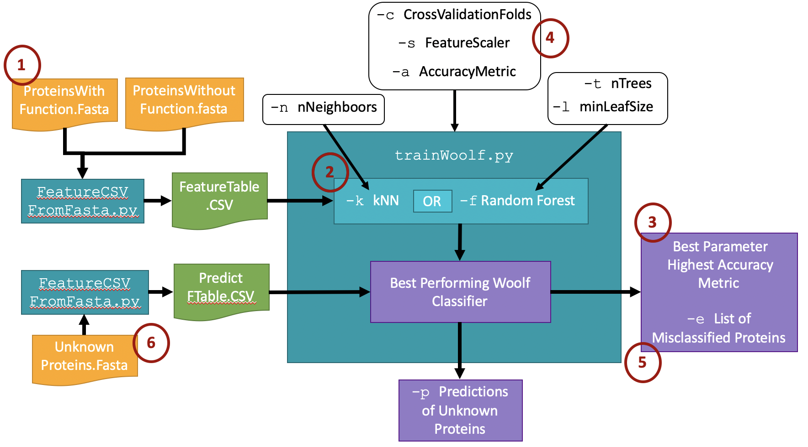

# Woolf Model User Guide

## Introduction

In this tutorial,
you will go through the steps to build a Woolf model classifier
that can classify a β-lactamase gene as either Class A or not Class A
(one of either class B, C, or D),
as well as learning how to modify and customize machine learning classifiers
using the Woolf Pipeline.

### What is a β-lactamase?

β-lactamases are used by a wide variety of bacteria
to evade the toxic effect of β-lactam type antibiotics
including penicillin family antibiotics and cephalosporins.
As the first drug ever developed to treat bacterial infection,
penicillin and penicillin-like drugs
have been used to tread a wide verity of bacterial diseases
since the 1930s.
Their long use history has allowed bacteria to evolve
a number of different strategies to avoid β-lactams’ toxic effects.
These strategies are encoded in the bacteria’s DNA
as a diverse set of antibiotic resistance genes,
called β-lactamases,
that are classified into 4 types based on the way they function.
The classes are labeled Class A, Class B, Class C, and Class D.

### Files Provided

Files can be downloaded [from OSF here](https://osf.io/gtjfq/download),
or with the following command:

```sh
$ curl -Lo tutorialfiles.zip https://osf.io/gtjfq/download
```

FASTA amino acid sequence files:
  -   `ClassA.fasta`
  -   `ClassBCD.fasta`
  -   `ClassA_test.fasta`
  -   `ClassBCD_test.fasta`
  -   `unknownClass.fasta`


## Installation

The Woolf Classifier Building Pipeline can be installed in one line
(including dependancies) with:

```sh
$ pip install woolf
```

### Dependences

Dependances should install automatically.
If they do not, the commands for installation
and links to the documentation are provided below.
Also note that it is best practice
to store python projects inside a virtual environment
([see here](https://packaging.python.org/guides/installing-using-pip-and-virtualenv/)).

<!-- Note: `conda` has a different virtual environment setup, might be worth changing this link -->

#### `Python3`

You will need Python 3 rather than Python 2.7. You can install 3 if
you already have 2.7 by creating a virtual environment.

Install from: <https://realpython.com/installing-python/>

#### `Biopython`

```sh
$ pip install biopython
```

Documentation: <https://biopython.org/wiki/Packages>

#### `Scikit-Learn`

```sh
$ pip install -U numpy scipy scikit-learn
```

Documentation: <https://scikit-learn.org/0.16/install.html>

#### `Pandas`

```sh
$ pip install pandas
```

Documentation: https://pandas.pydata.org/pandas-docs/stable/install.html

#### `Argparse`

```sh
$ pip install argparse
```

<!-- I'm currently only testing against python 3.4+.
      Do you actually want to claim to support earlier versions?-->
Only required if you have python <3.2.
[Documentation link](https://pypi.org/project/argparse/).

#### `Sys` and `Ast`

May or may not need manual installation with:

```sh
$ pip install sys
```

```sh
$ pip install ast
```

## Overview: Steps in Building a Woolf Model

Woolf Classifiers can be built
using two simple command line scripts
in 6 steps.

(1) Input FASTA files are converted into a feature table
based on length and amino acid composition
before (2) being used to train a model with either a kNN
or random forest algorithm.
The default parameters lead to an initial report of accuracy
and best parameters (3)
which can then be fine-tuned as inputs to the command (4).
Users can also ask to see a list
of the protein sequences misclassified
by the best scoring classifier in each model (5)
and predict the classes of unknown proteins (6).



The two commands used in the the pipeline are:

```
featureTable
usage: featureTable [-h] [-c COMPARISONFILENAME] [-f FOLDER] [-b | -t]
                    [-p POSFASTA [POSFASTA ...]] [-n NEGFASTA [NEGFASTA ...]]
                    [-u UNKNOWNFASTA [UNKNOWNFASTA ...]]

Build a CVS feature table from amino acid FASTA files

optional arguments:
  -h, --help            show this help message and exit
  -c COMPARISONFILENAME, --comparisonFileName COMPARISONFILENAME
                        an identifying tag for all output files
  -f FOLDER, --folder FOLDER
                        A folder to contain the output files
  -b, --binary
  -t, --predict
  -p POSFASTA [POSFASTA ...], --posFasta POSFASTA [POSFASTA ...]
                        one or more FASTA files containing amino acid
                        sequences belonging to the positive class
  -n NEGFASTA [NEGFASTA ...], --negFasta NEGFASTA [NEGFASTA ...]
                        one or more FASTA files containing amino acid
                        sequences belonging to the negative class
  -u UNKNOWNFASTA [UNKNOWNFASTA ...], --unknownFasta UNKNOWNFASTA [UNKNOWNFASTA ...]
                        one or more FASTA files containing amino acid
                        sequences of unknown function
```

```
trainWoolf
usage: trainWoolf [-h] [-k | -f] [-n NNEIGHBORS] [-t NTREES] [-l MINLEAFSIZE]
                  [-s FEATURESCALER] [-c CROSSVALIDATIONFOLDS]
                  [-a ACCURACYMETRIC] [-p PREDICTFEATURETABLE] [-e] [-v]
                  featureTable

create a Woolf Model based a feature table

positional arguments:
  featureTable          a CSV file containing feature data from a set of
                        sequences

optional arguments:
  -h, --help            show this help message and exit
  -k, --kNN
  -f, --randomForest
  -n NNEIGHBORS, --nNeighbors NNEIGHBORS
                        number of neighboors for kNN classifier, ranges are
                        expresed as low-hi,jump (1-7,2 would test 1,3,5 and 7)
  -t NTREES, --nTrees NTREES
                        number of trees for random forest classifier, ranges
                        are expresed as low-hi,jump (1-7,2 would test 1,3,5
                        and 7)
  -l MINLEAFSIZE, --minLeafSize MINLEAFSIZE
                        minimum size of leaves in each tree of the random
                        forest classifier, ranges are expresed as low-hi,jump
                        (1-7,2 would test 1,3,5 and 7)
  -s FEATURESCALER, --featureScaler FEATURESCALER
                        a scikit learn scaler object to scale in the input
                        features
  -c CROSSVALIDATIONFOLDS, --crossValidationFolds CROSSVALIDATIONFOLDS
                        the number of cross validation folds to execute
  -a ACCURACYMETRIC, --accuracyMetric ACCURACYMETRIC
                        a scikit learn accuracy metric for training
  -p PREDICTFEATURETABLE, --predictFeatureTable PREDICTFEATURETABLE
                        a unclassified feature table to be predicted by the
                        model
  -e, --listErrors      include to see a list of which sequences in the
                        training dataset were missclassified
  -v, --verbose         inlcude to get more detailed output
```

The `-h` option for either of these commands
will display this help message.
If you are using a virtual environment make sure it is activated!

### STEP 1: Creating the feature tables

The FASTA files provided in the tutorial have already been split
into positive (Class A)
and negative (Class B, C, and D),
with test data reserved for a final accuracy measure,
and an unknown set of data.
Use the `featureTable` script to create three CSV-based feature tables,
one for training,
one final one for testing after you have made all the modifications to the data,
and one unlabeled table for prediction.

Training:

```sh
$ featureTable --binary --comparisonFileName AvsNotA --folder CSVfolder --posFasta classA.fasta --negFasta classBCD.fasta
```

This command creates a binary feature table
(not prediction because it has class labels)
that uses the Class A sequences as the positive class,
and the Class B, C, and D sequences as the negative class.

Testing:

```sh
$ featureTable --binary --comparisonFileName AvsNotA_TEST --folder CSVfolder --posFasta classA_test.fasta --negFasta classBCD_test.fasta
```

Prediction:

```sh
$ featureTable --predict --comparisonFileName AvsNotA_UNKNOWN --folder CSVfolder --unknownFasta unknownClass.fasta
```

After each command,
you should get confirmation from the command line
that the file created was the type of table you intended,
and that it has been saved to the folder with the filename you indicated.
Check to make sure the three feature table files
are where you think they should be
and that they contain feature data before continuing.

### STEP 2: Running Model with Default Parameters

Now that you have your feature tables,
you can build a model to differentiate between Class A
and non-Class A β-lactamases.

First, build a classifier using a kNN algorithm
trained on the training feature table:

```sh
$ trainWoolf --kNN CSVfolder/AvsNotA.csv
```

The output should look something like what is shown below.
The numbers may be different
because the instances are shuffled randomly
when the feature table is created.

```
Building kNN Woolf Model...
Training Model...
~~~~~~    RESULTS    ~~~~~~
Score of best classifier: 0.9341399452564743
Best Params:{'clf__n_neighbors': 1}
~~~~~~               ~~~~~~
```

This indicates that the model
achieved an MCC score of 0.93
using `k=1` as an algorithm parameter.
You can get more information about the model
by running the command with the `--verbose` option as shown below:

```
$ trainWoolf --kNN CSVfolder/AvsNotA.csv --verbose

Building kNN Woolf Model...
Cross-validation Folds: 5
Scoring Metric: MCC
Scaler type: MinMaxScaler
Training Model...
~~~~~~    RESULTS    ~~~~~~
Score of best classifier: 0.9341399452564743
Best Params:{'clf__n_neighbors': 1}
Range of classifier scores across hyperparameters:
  Max: 0.9341399452564743
  Min: 0.9102718547149868
Range of training scores across hyperparameters:
  Max: 1.0
  Min: 0.9164094302860978
~~~~~~               ~~~~~~
```

### STEP 3: Accuracy Metric Evaluation

There is no rule about what makes an accuracy metric "good",
but each time you get results from the Woolf model,
you can do some reasoning about how well your classifier is working.
Examine your results and determine
if the accuracy and hyperparameter values
are in the range you were looking for.

Keep in mind that the main goal of the Woolf Pipeline
is to provide useful hypothesis generating, biologically relevant
insight into protein sequences,
not to create the best possible computational model,
and no definitive number will be able to tell you
if a classifier is "good enough."

### STEP 4: Modifying Default Parameters

The parameters defined Table 4.1
can be specified by the user
to improve the classification power of Woolf Classifiers.

**Table 4.1** User specified parameters

  | Parameter                                                         | Default Option     | Option Flag              | How to Format Input
  |-------------------------------------------------------------------|--------------------|--------------------------|--------------------
  | Feature scaling type                                              | Min-Max Scaling    | `--featureScaler`        | StandardScaler<br>MaxAbsScaler
  | Cross-validation folds                                            | 5                  | `--crossValidationFolds` | 10<br>20
  | Accuracy metric                                                   | MCC                | `--accuracyMetric`       | accuracy<br>f1
  | Number of neighbors (kNN only)                                    | range from 1 to 20 | `--nNeighbors`           | 5<br>1-20<br>1-30,5
  | Number of trees (random forest only)                              | range from 1 to 20 | `--nTrees`               | 5<br>1-20<br>1-30,5
  | Minimum instances per leaf (random forest only)                   | 10, 15, 20, 25, 30 | `--minLeafSize`          | 10<br>10-0<br>10-30,5


**Hyperparameter Ranges**

These options control
the hyperparameter values tested by the Woolf Pipeline
and optimized in your model.
If you have a small dataset,
all the values will need to be smaller.
`k` values will self-regulate and get smaller with smaller datasets,
but you will need to impose upper and lower limits
for the number of trees
and the minimum samples per leaf
in a random forest model to prevent overfitting.
As a general rule of thumb,
try to have 20 instances per tree,
and a minimum leaf size of approximately 1/20 of the data.
However, as stated above,
the goal is biological relevance, not machine learning perfection,
so there is no hard and fast rule.

For example,
to create a kNN model that tests the `k` values of 1, 3, 5, and 7,
you could use:

```sh
$ trainWoolf --kNN CSVfolder/AvsNotA.csv --nNeighbors 1-7,2
```

**Cross-Validation Folds**

To create a model with 10 rather than 5 cross-validation folds,
run the command like this:

```sh
$ trainWoolf --kNN CSVfolder/AvsNotA.csv --crossValidationFolds 10
```

Note that the number of cross validation folds
must be greater than 1
so that the data can be split at least once.
In general,
greater numbers of cross-validation folds take longer to run
but give better estimates of the model’s accuracy.
If the number of folds is too high for the dataset,
you may get an error
because there is not enough training data in each split
to train the model.

**Scaler Value**

Scaling is the process of modifying the center and range of the data
in each feature.
It is used to modify input data distributions
to meet the assumptions most algorithms make about their input data.
Random forests are tree based and do not require scaling.
However, with algorithms like kNNs,
scaling the data prevents features with different ranges
from unduly influencing the prediction.

Table 4.2 shows the range of different scaler types
and when they might be useful.

**Table 4.2** Possible Scaler Types

Scaler Name    | Function                                                                      | Suggested Use Cases
---------------|-------------------------------------------------------------------------------|-----------------------------------------------------------------------------------------
StandardScaler | Scales each feature to zero mean and unit variance                            | - General use
MinMaxScaler   | Scales each feature to a range between 0 and 1                                | - Sparse data<br>- Possible zeros in data<br>- Small standard deviations
MaxAbsScaler   | Scales each feature to a range between -1 and 1                               | - Sparse data<br>- Possible negative data<br>- Small standard deviations
RobustScaler   | Scales using alternative center and range metrics that are robust to outliers | - Data with outliers
None           | No scaling                                                                    | - Approximately normally distributed data in similar ranges<br>- comparison to other methods

To change the scaler type from the default Min-Max Scaler to the Standard Scaler,
use this command:

```sh
$ trainWoolf --kNN CSVfolder/AvsNotA.csv --featureScaler StandardScaler
```

**Accuracy Metric**

There are five options to assess the accuracy of your classifier.
These metrics are used at each stage within cross validation
and reported at the end of the training.
The default option is the Matthews Correlation Coefficient (MCC),
which has been shown to be good for small, unbalanced datasets
where both the positive and negative class are important.

To use percentage accuracy as the accuracy metric
instead of the default MCC, use this command:

```sh
$ trainWoolf --kNN CSVfolder/AvsNotA.csv --accuracyMetric accuracy
```

All possible accuracy metrics are described in Table 4.3.

 **Table 4.3 Possible Accuracy Metrics.** All implementations come from the scikit-lean preprocessing package \[101\].

Metric    | Description                                                                         | Function                                                                                  | Suggested Use Cases
----------|-------------------------------------------------------------------------------------|-------------------------------------------------------------------------------------------|----------------------------------------------------------------------------------
accuracy  | Percentage of instances classified correctly                                        |                                                      | Balanced class distributions of instances
recall    | Proportion of actually positive instances that are correctly identified as positive |                                                            | When the most important result it to identify all the positive cases
precision | Proportion of predicted positive instances that are actually positive               |                                                              | When it is important to make sure all the predicted positives are really positive
f1        | Harmonic mean of recall and precision                                               |                                                            | When both recall and precision are important
MCC       | Combination of all terms from confusion matrix                                      |  | Small datasets in which both positive and negative classes are important

### STEP 5: Listing Misclassified Proteins

To determine which proteins are misclassified by your final model,
run the script again with the `--listErrors` option.
Assuming your final model was a kNN trained with percentage accuracy
and 3-10 as possible k values,
you would run the following command:

```sh
$ trainWoolf --kNN CSVfolder/AvsNotA.csv --accuracyMetric accuracy --nNeighbors 3-10 --listErrors
```

You should get results that look like this:

```
Building kNN Woolf Model...
Training Model...
~~~~~~    RESULTS    ~~~~~~
Score of best classifier: 0.9650175573162738
Best Params:{'clf__n_neighbors': 3}
~~~~~~               ~~~~~~
Listing misclassified instances
misclassified as positive class:
 ['WP_119744827.1', 'WP_123152110.1', 'ABP89167.1', 'SDU95206.1', 'WP_119898025.1', 'SFE08607.1', 'WP_086947865.1', 'AEK44086.1', 'SEE70256.1', 'WP_011759294.1', 'EIT76073.1', 'WP_008600118.1', 'WP_126391239.1', 'WP_033095006.1', 'WP_037169020.1', 'WP_004421712.1', 'AIV76081.1', 'WP_116568761.1', 'WP_013752449.1', 'WP_012287432.1', 'WP_128836872.1', 'WP_058022919.1', 'KUK79721.1', 'WP_119340951.1', 'WP_026824192.1', 'SEE30393.1', 'WP_012895319.1', 'WP_012831211.1', 'WP_101502916.1', 'WP_008504272.1', 'WP_013151481.1', 'WP_121940274.1', 'WP_036939920.1', 'WP_011497575.1', 'WP_002620967.1', 'WP_029160222.1', 'WP_127568596.1', 'WP_124804005.1']
misclassified as negative class:
 ['WP_117176239.1', 'WP_123069295.1', 'WP_008546521.1', 'WP_128795559.1', 'WP_115327361.1', 'WP_128836873.1', 'WP_120215311.1', 'WP_123637641.1', 'WP_124114574.1', 'WP_114910097.1', 'WP_116612552.1', 'WP_115241962.1', 'WP_023978354.1', 'WP_076381892.1', 'WP_115181656.1', 'WP_012225639.1', 'WP_127566621.1', 'WP_115300326.1', 'WP_129654766.1', 'WP_128797655.1', 'WP_126634890.1', 'WP_118763952.1', 'WP_128946536.1', 'WP_124325291.1', 'WP_115320774.1', 'WP_125148997.1', 'WP_123657470.1', 'WP_128911376.1', 'WP_129584969.1', 'WP_007481284.1', 'WP_126337303.1', 'WP_128617379.1', 'WP_114889885.1', 'WP_116675890.1', 'WP_126167828.1']
```

The output lists the proteins in the training data that were either

- misclassified as Type A but actually belong to one of the other classes
  (misclassified as positive class)
- or were misclassified as _not_ Type A but in fact _are_ Type A
  (misclassified as negative class).

These barcodes can be used to find the original sequences for further analysis.

### STEP 6: Predicting New Proteins

The final step in the Woolf Classification Building Pipeline
is to actually predict the function of new proteins.
This is done with the `--predictFeatureTable` option.
Before you perform this step,
it is useful to get a final accuracy measure
with data that has never been through the model up until now.
This is done with the same option flag.

To test a model with the test data feature table you made in step one
use the following command:

```sh
$ trainWoolf --kNN CSVfolder/AvsNotA.csv --predictFeatureTable CSVfolder/AvsNotA_TEST.csv
```

You should see results like this:

```
Building kNN Woolf Model...
Training Model...
~~~~~~    RESULTS    ~~~~~~
Score of best classifier: 0.9341399452564743
Best Params:{'clf__n_neighbors': 1}
~~~~~~               ~~~~~~
Predicting novel instances
{'WP_032017448.1': 0, 'WP_013188473.1': 1, 'WP_060437608.1': 0, 'WP_006686288.1': 0, 'WP_014007498.1': 0, 'WP_044390253.1': 0, 'WP_034622813.1': 0, 'WP_047597435.1': 0, 'WP_110123529.1': 1, 'WP_016162495.1': 0, 'WP_000778180.1': 0, 'WP_001417211.1': 0, 'WP_000239590.1': 1, 'WP_004910271.1': 0, 'WP_020914447.1': 0, 'WP_032037742.1': 0, 'WP_050534676.1': 0, 'WP_063862728.1': 0, 'WP_007761109.1': 0, 'WP_050073671.1': 0, 'WP_050321664.1': 0, 'WP_046855210.1': 0, 'WP_036948496.1': 0, 'WP_013691409.1': 0,
# ... some output omitted ...
'WP_065872869.1': 0, 'WP_025395172.1': 0, 'WP_050088644.1': 0, 'WP_037140816.1': 0, 'WP_013983315.1': 0, 'WP_011860820.1': 0, 'WP_050335261.1': 0, 'WP_005111907.1': 0, 'WP_065878451.1': 0, 'WP_045460298.1': 0, 'WP_072078020.1': 0, 'WP_039496288.1': 0, 'WP_004923631.1': 0, 'WP_032009364.1': 0, 'WP_042560048.1': 0, 'WP_072089562.1': 0, 'WP_060769150.1': 0, 'WP_045149331.1': 0, 'WP_029307868.1': 0, 'WP_020835015.1': 1, 'WP_020288732.1': 0, 'WP_046101847.1': 0, 'WP_023653734.1': 0, 'WP_047954938.1': 0, 'WP_065909522.1': 0, 'WP_000352430.1': 1, 'WP_063862719.1': 0}
Score on test data: 0.987116201732058
```

The overall accuracy score is the last number printed.

Finally,
to run the model to predict your unknown proteins,
use the following command.
Remember that `AvsNotA_UNKNOWN.csv`
is a feature table file you generated in step 1.

```sh
$ trainWoolf --kNN CSVfolder/AvsNotA.csv --predictFeatureTable CSVfolder/AvsNotA_UNKNOWN.csv
```

The results should look like this:

```
Building kNN Woolf Model...
Training Model...
~~~~~~    RESULTS    ~~~~~~
Score of best classifier: 0.9341399452564743
Best Params:{'clf__n_neighbors': 1}
~~~~~~               ~~~~~~
Predicting novel instances
{'WP_001208005.1': 1, 'WP_000817293.1': 0, 'WP_001208011.1': 1, 'WP_001667037.1': 0, 'WP_002852433.1': 0, 'WP_001082979.1': 1, 'WP_001317977.1': 0, 'WP_001630205.1': 0, 'WP_001931474.1': 1, 'WP_020837858.1': 1, 'WP_001327042.1': 0, 'WP_000673293.1': 0, 'WP_001299057.1': 0, 'WP_000830777.1': 0, 'WP_001082962.1': 1, 'WP_000830757.1': 0, 'WP_021577770.1': 0, 'WP_023216810.1': 1, 'WP_002776717.1': 0, 'WP_111742248.1': 1, 'WP_022645952.1': 0, 'WP_000673298.1': 0, 'WP_050067789.1': 0, 'WP_023993659.1': 0, 'WP_057991827.1': 0, 'WP_000673287.1': 0, 'WP_023259161.1': 0, 'WP_002865991.1': 0, 'WP_020899073.1': 0, 'WP_000830775.1': 0, 'WP_017442020.1': 1, 'WP_001631316.1': 1, 'WP_023224609.1': 1, 'WP_001520983.1': 0, 'WP_002856956.1': 0, 'WP_000830773.1': 0, 'WP_001082975.1': 1, 'WP_001082970.1': 1, 'WP_000059908.1': 0, 'WP_000188069.1': 0}
```

And that is it!
You have built a Woolf Classifier <!-- I thought we weren't calling it this -->
that can predict if novel β-lacamases are Type A or not Type A.
Using the barcodes provided in by the `--predictFeatureTable` option,
you can further study these sequences
using any conventional experimental or computational technique.
